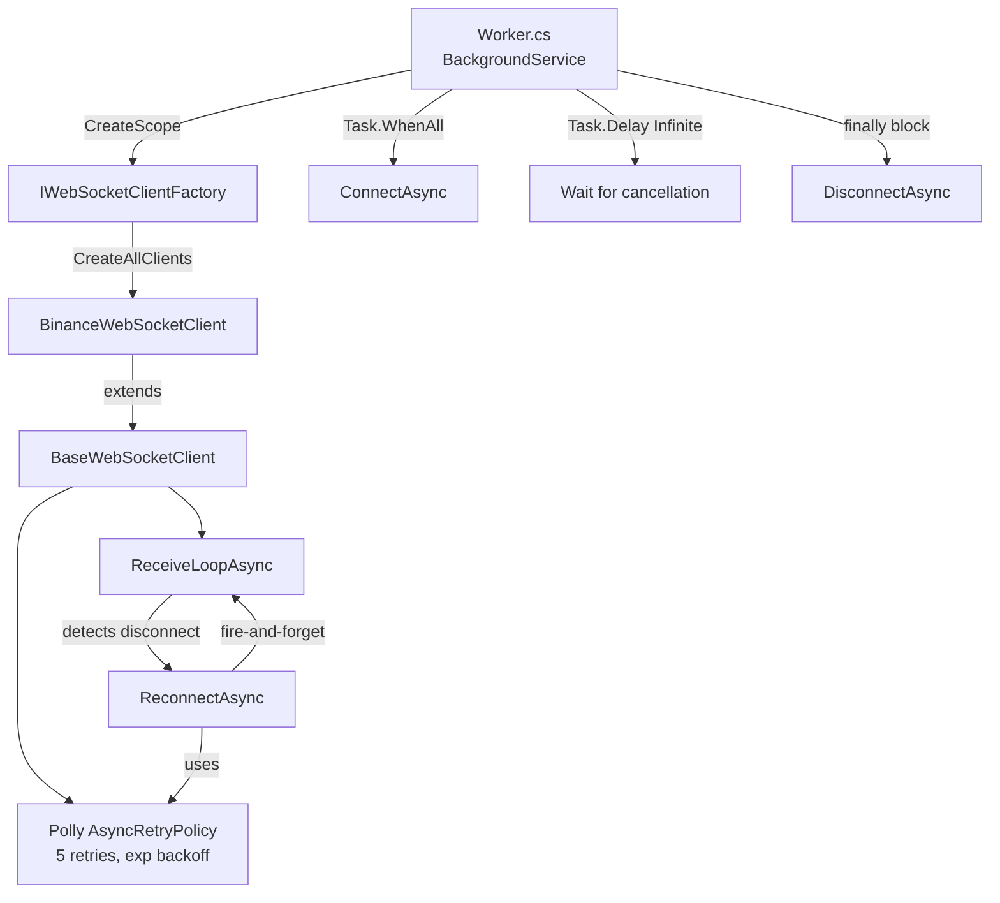
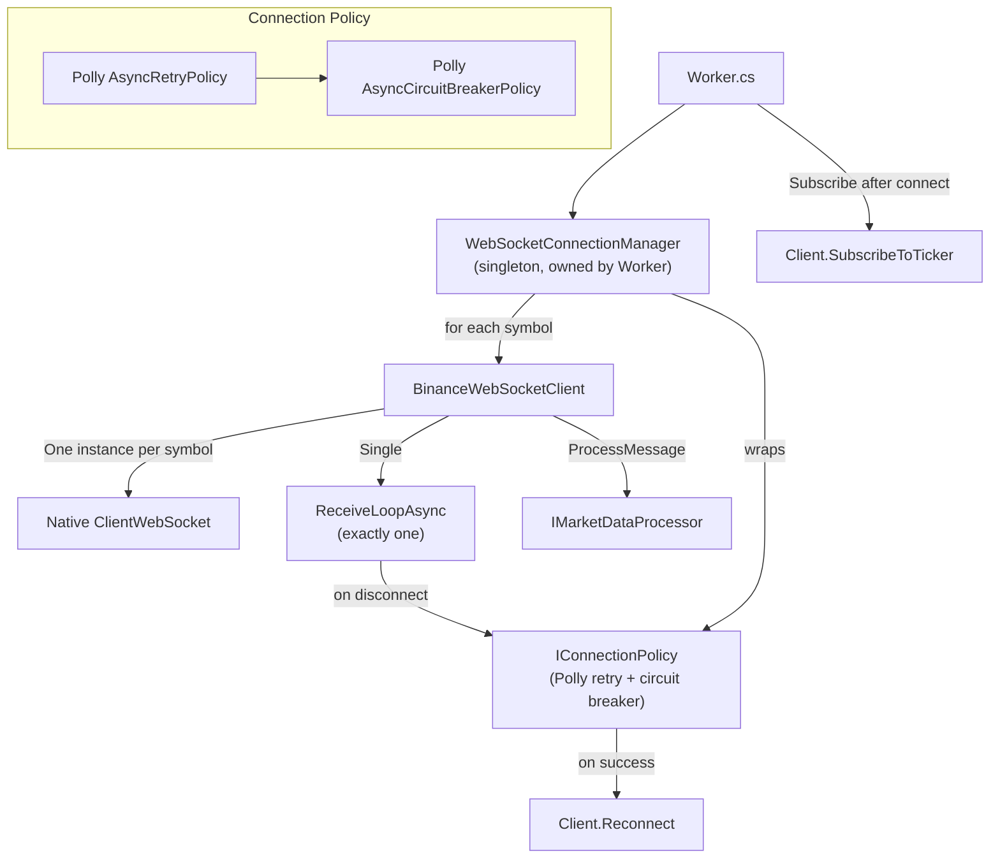
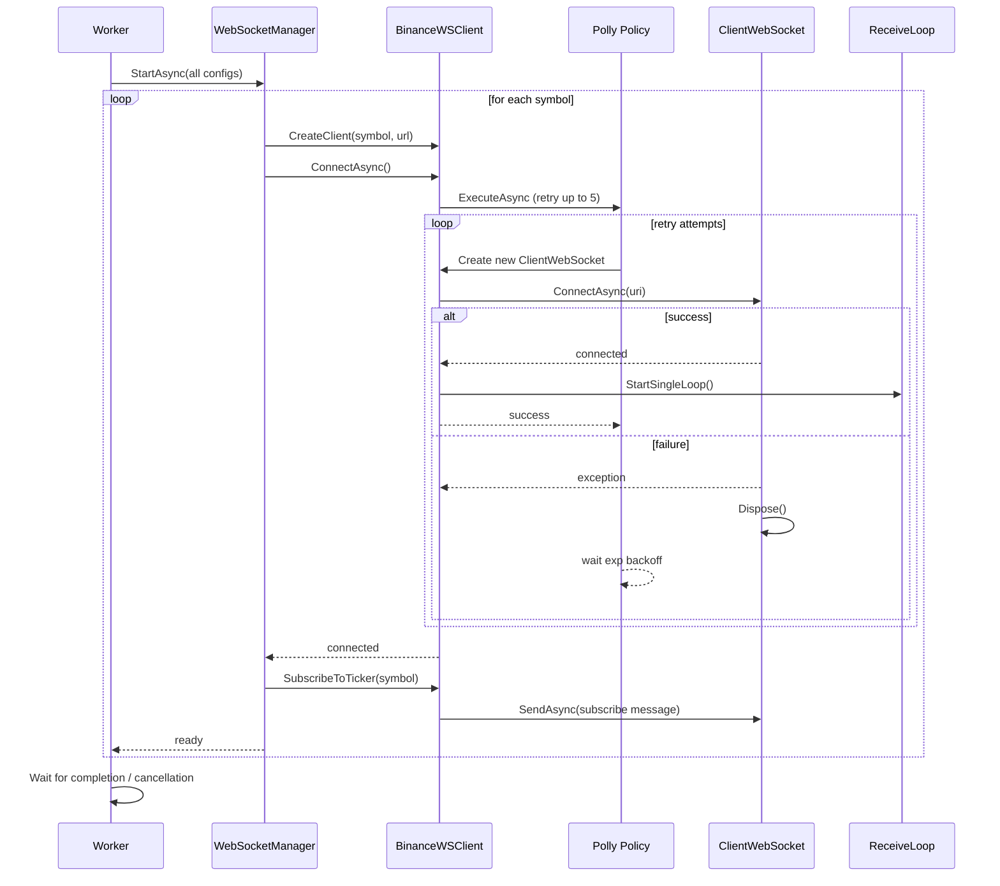

# Архитектурный review: WebSocket + Polly в MarketDataCollector

## 1. Текущая архитектура (as-is)



## 2. Найденные архитектурные проблемы

### 🔴 Проблема 1: `SubscribeToTicker()` никогда не вызывается

В [`Worker.cs:37-39`](src/MarketDataCollector.Workers/MarketDataCollector.Worker/Worker.cs:37) выполняется `ConnectAsync()`, но после подключения нигде не вызывается `SubscribeToTicker(symbol)`. Клиент подключается к Binance stream по URL вида `wss://stream.binance.com:9443/ws/btcusdt@trade`, но без отправки subscribe-сообщения соединение висит без дела.

### 🔴 Проблема 2: Polly обёртывает одноразовый `ClientWebSocket`

В [`BaseWebSocketClient.cs:160-166`](src/MarketDataCollector.Core/Clients/BaseWebSocketClient.cs:160):
```csharp
_webSocket = new ClientWebSocket();  // создаётся ДО Polly
await _retryPolicy.ExecuteAsync(async () =>
{
    await _webSocket.ConnectAsync(_uri, cancellationToken); // тот же экземпляр
});
```

`ClientWebSocket` — **single-use объект**. После неудачной попытки `ConnectAsync` его нельзя переиспользовать. Если первая попытка упала, Polly ретраит — но пытается вызвать `ConnectAsync` на **том же** экземпляре, что приведёт к ошибке `WebSocketException` или некорректному состоянию.

**То же самое** в [`ConnectAsync:53-62`](src/MarketDataCollector.Core/Clients/BaseWebSocketClient.cs:53) — `_webSocket` создаётся в конструкторе, а Polly ретраит `ConnectAsync` на нём же.

### 🔴 Проблема 3: Множественные `ReceiveLoopAsync` (fire-and-forget рекурсия)

- [`BaseWebSocketClient.cs:61`](src/MarketDataCollector.Core/Clients/BaseWebSocketClient.cs:61) — `ConnectAsync` запускает `ReceiveLoopAsync` через `_ = Task.Run(...)`
- [`BaseWebSocketClient.cs:165`](src/MarketDataCollector.Core/Clients/BaseWebSocketClient.cs:165) — `ReconnectAsync` тоже запускает `ReceiveLoopAsync` через `_ = Task.Run(...)`
- [`BaseWebSocketClient.cs:101-106`](src/MarketDataCollector.Core/Clients/BaseWebSocketClient.cs:101) — `ReceiveLoopAsync` при разрыве соединения вызывает `ReconnectAsync`, который запускает **ещё один** `ReceiveLoopAsync`, после чего текущий цикл продолжается (`continue`)

**Итог**: после каждого переподключения работает на 1 `ReceiveLoopAsync` больше. Это приводит к:
- Конкурентной обработке одних и тех же сообщений
- Утечке Task'ов
- Неконтролируемому росту числа потоков

### 🔴 Проблема 4: Race condition при перезаписи `_webSocket`

Поле `_webSocket` в [`BaseWebSocketClient.cs:14`](src/MarketDataCollector.Core/Clients/BaseWebSocketClient.cs:14) — mutable, доступное из нескольких потоков без синхронизации:
- `ConnectAsync` читает `IsConnected` (строка 50), который читает `_webSocket.State`
- `ReceiveLoopAsync` читает `IsConnected` и вызывает `_webSocket.ReceiveAsync`
- `ReconnectAsync` перезаписывает `_webSocket` (строка 157) и вызывает `_webSocket.Dispose()`
- `DisconnectAsync` вызывает `_webSocket.CloseAsync`
- `Dispose` вызывает `_webSocket.Dispose()`

### 🟡 Проблема 5: Scoped-сервисы живут дольше scope'а

`IWebSocketClientFactory` зарегистрирован как Scoped, его зависимость `IMarketDataProcessor` — тоже Scoped. Worker создаёт scope в `ExecuteAsync`, но fire-and-forget `ReceiveLoopAsync` может пережить `ExecuteAsync` (если `stoppingToken` уже сработал, а `ReceiveLoopAsync` не успел завершиться). При этом `MarketDataProcessor` внутри использует `IRawTickRepository` (Scoped → зависимость от `DbContext`), который будет умён после dispose scope'а.

### 🟡 Проблема 6: Worker не обрабатывает ошибки соединения после старта

`Worker.cs` делает `ConnectAsync` с Polly — ретраит 5 раз. Если все 5 попыток неудачны, `ConnectAsync` выбрасывает исключение, которое ловится в `catch (Exception ex)` на строке 49-52. Worker логирует ошибку и завершает `ExecuteAsync`. **Повторных попыток на уровне Worker нет**, сервис просто падает.

### 🟡 Проблема 7: `Take(1)` в Worker

[`Worker.cs:27`](src/MarketDataCollector.Workers/MarketDataCollector.Worker/Worker.cs:27):
```csharp
var clients = clientFactory.CreateAllClients().Take(1).ToList();
```

Независимо от количества сконфигурированных ридеров (5 в appsettings), обрабатывается только первый. Это выглядит как временная заглушка или отладка, но в коде нет комментария, объясняющего почему.

## 3. Рекомендуемая архитектура (to-be)



### Ключевые принципы новой архитектуры:

1. **Один `ClientWebSocket` — одна попытка подключения**. Если надо ретраить — создавай новый экземпляр внутри делегата Polly.
2. **Один `ReceiveLoopAsync` на клиент**. Использовать `Interlocked.Exchange` или CancellationTokenSource для гарантии.
3. **Разделение ответственности**: клиент только управляет соединением и протоколом, политика повторных подключений — внешняя.
4. **Worker управляет жизненным циклом**: подключение → подписка → обработка → переподключение при ошибке.
5. **Нормальное масштабирование**: обрабатывать ВСЕ ридеры из конфига, а не `.Take(1)`.

## 4. План рефакторинга

### Шаг 1: Исправить Polly + ClientWebSocket lifecycle

**Файлы**: [`BaseWebSocketClient.cs`](src/MarketDataCollector.Core/Clients/BaseWebSocketClient.cs)

**Изменения**:
- Убрать создание `_webSocket = new ClientWebSocket()` из конструктора
- В `ConnectAsync` и `ReconnectAsync` создавать новый `ClientWebSocket` **внутри** делегата Polly, на каждую попытку
- После успешного `ConnectAsync` сохранять `ClientWebSocket` в поле `_webSocket` под lock'ом

```csharp
// Вместо:
await _retryPolicy.ExecuteAsync(async () =>
{
    await _webSocket.ConnectAsync(_uri, cancellationToken);
});

// Должно быть:
await _retryPolicy.ExecuteAsync(async () =>
{
    var ws = new ClientWebSocket();
    await ws.ConnectAsync(_uri, cancellationToken);
    Interlocked.Exchange(ref _webSocket, ws)?.Dispose(); // замена + dispose старого
});
```

### Шаг 2: Гарантировать единственный ReceiveLoopAsync

**Файлы**: [`BaseWebSocketClient.cs`](src/MarketDataCollector.Core/Clients/BaseWebSocketClient.cs)

**Изменения**:
- Добавить поле `Task _receiveLoopTask` и `CancellationTokenSource _receiveLoopCts`
- При запуске `ReceiveLoopAsync` отменять предыдущий `_receiveLoopCts` и дожидаться его (graceful cancellation)
- `ReconnectAsync` **не запускает** новый `ReceiveLoopAsync` — он просто переподключает сокет
- `ReceiveLoopAsync` после `ReconnectAsync` продолжает цикл на новом сокете

### Шаг 3: Добавить синхронизацию для `_webSocket`

**Файлы**: [`BaseWebSocketClient.cs`](src/MarketDataCollector.Core/Clients/BaseWebSocketClient.cs)

**Изменения**:
- Все чтения/записи `_webSocket` через `Volatile.Read` / `Interlocked.Exchange`
- Либо использовать `ReaderWriterLockSlim` для сложных операций
- `IsConnected` проверяет через локальную копию `_webSocket`

### Шаг 4: Добавить политику Circuit Breaker поверх Retry

**Файлы**: Новый [`BaseWebSocketClient.cs`](src/MarketDataCollector.Core/Clients/BaseWebSocketClient.cs) или [`ConnectionPolicy.cs`](src/MarketDataCollector.Core/Clients/ConnectionPolicy.cs)

**Изменения**:
- Если биржа недоступна, бесконечные retry бессмысленны
- Добавить `AsyncCircuitBreakerPolicy` — после N неудачных попыток подряд перейти в Open состояние на N секунд
- Retry-политику сделать вложенной внутрь Circuit Breaker

### Шаг 5: Вызов `SubscribeToTicker` в Worker

**Файлы**: [`Worker.cs`](src/MarketDataCollector.Workers/MarketDataCollector.Worker/Worker.cs)

**Изменения**:
- После `ConnectAsync` для каждого client вызвать `client.SubscribeToTicker(reader.Symbol)`
- Для этого нужно знать, какой символ соответствует какому клиенту

### Шаг 6: Убрать `Take(1)` и обрабатывать все ридеры

**Файлы**: [`Worker.cs`](src/MarketDataCollector.Workers/MarketDataCollector.Worker/Worker.cs), [`IWebSocketClientFactory.cs`](src/MarketDataCollector.Core/Interfaces/IWebSocketClientFactory.cs), [`WebSocketClientFactory.cs`](src/MarketDataCollector.Infrastructure/Factories/WebSocketClientFactory.cs)

**Изменения**:
- Вернуть `IEnumerable<IExchangeWebSocketClient>` без `Take(1)`
- Изменить `CreateAllClients()` чтобы возвращал Tuple `(IExchangeWebSocketClient, ReaderConfig)` или добавить Symbol в сам клиент
- Worker обрабатывает все подключения параллельно и для каждого вызывает `SubscribeToTicker`

### Шаг 7: Graceful shutdown + обработка ошибок в Worker

**Файлы**: [`Worker.cs`](src/MarketDataCollector.Workers/MarketDataCollector.Worker/Worker.cs)

**Изменения**:
- Заменить `Task.Delay(Timeout.Infinite, stoppingToken)` на `Task.WhenAll(clients.Select(c => c.WaitForCloseAsync(stoppingToken)))` — асинхронное ожидание завершения клиентов
- При ошибке подключения всех клиентов — не падать сразу, а повторять попытку через некоторое время (outer retry loop в Worker)
- В `catch` блоке — логировать и перезапускать подключение, а не выходить

### Шаг 8: Добавить утилиту для Atomic идемпотентного запуска ReceiveLoop

**Файлы**: Новый [`AtomicTaskSwitch.cs`](src/MarketDataCollector.Core/Clients/AtomicTaskSwitch.cs) (или внутри BaseWebSocketClient)

**Изменения**:
- Вспомогательный метод `TryStartReceiveLoop()` который гарантирует, что только один `ReceiveLoopAsync` работает в данный момент
- Использует `Interlocked.CompareExchange` на `Task` поле

## 5. Mermaid: Диаграмма последовательности корректного подключения



## 6. Приоритет изменений

| Приоритет | Изменение | Почему |
|-----------|-----------|--------|
| P0-crash | Шаг 1: ClientWebSocket внутри Polly | Сейчас соединения НЕ работают при ретраях |
| P0-crash | Шаг 2: Единственный ReceiveLoop | Утечка потоков, дублирование сообщений |
| P0-crash | Шаг 5: Вызов SubscribeToTicker | Сейчас клиент не получает данные |
| P1-critical | Шаг 3: Синхронизация _webSocket | Race conditions, нестабильное поведение |
| P1-critical | Шаг 6: Убрать Take(1) | Обрабатывается только 1 ридер из 5 |
| P2-important | Шаг 4: Circuit Breaker | Защита от DDoS биржи при недоступности |
| P2-important | Шаг 7: Graceful shutdown + outer retry | Надёжность production |
| P3-nice | Шаг 8: AtomicTaskSwitch | Чистота кода, идемпотентность |
